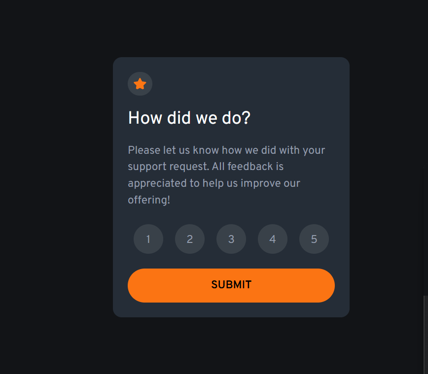

# Frontend Mentor - Interactive rating component solution

This is a solution to the [Interactive rating component challenge on Frontend Mentor](https://www.frontendmentor.io/challenges/interactive-rating-component-koxpeBUmI). Frontend Mentor challenges help you improve your coding skills by building realistic projects.

## Table of contents

- [Overview](#overview)
  - [The challenge](#the-challenge)
  - [Screenshot](#screenshot)
  - [Links](#links)
- [My process](#my-process)

  - [Built with](#built-with)
  - [What I learned](#what-i-learned)

- [Author](#author)

## Overview

### The challenge

Users should be able to:

- View the optimal layout for the app depending on their device's screen size
- See hover states for all interactive elements on the page
- Select and submit a number rating
- See the "Thank you" card state after submitting a rating

### Screenshot

### Links

- Live Site URL: [https://kirlosbasta.github.io/interactive-rating-component](https://kirlosbasta.github.io/interactive-rating-component)

## My process

### Built with

- Semantic HTML5 markup
- Flexbox
- Mobile-first workflow
- [React](https://reactjs.org/) - JS library
- [Tailwind CSS](https://tailwindcss.com/) - For styles

### What I learned

I learned how to create a simple interactive rating component using React and styled-components. The component allows users to select a rating and submit it, displaying a thank you message upon submission. I also practiced handling state in React and managing user interactions.

## Author

- Frontend Mentor - [@kirlosbasta](https://www.frontendmentor.io/profile/kirlosbasta)
- GitHub - [@kirlosbasta](https://github.com/kirlosbasta)
